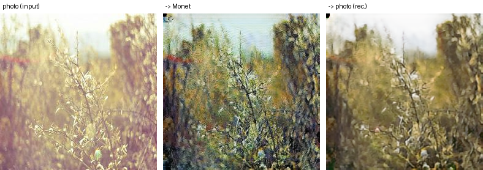
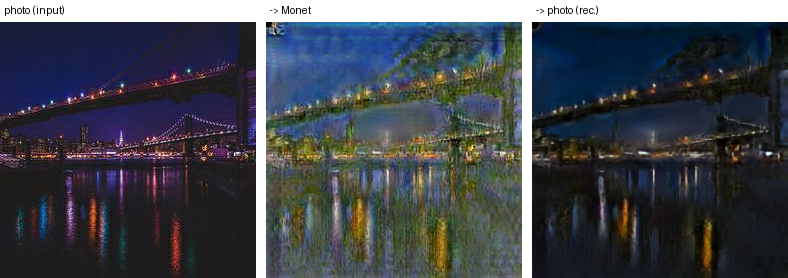
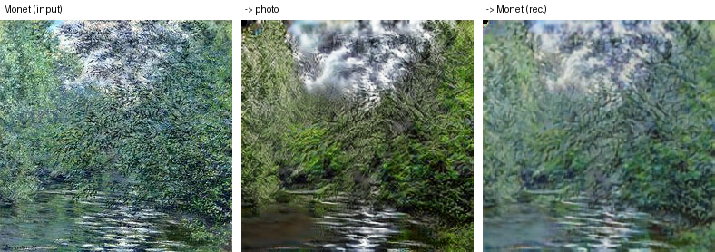

# Task 3 — Failure Cases (Chaitanya)

Model: the submitted generators `checkpoints/full_run18/epoch_123_ema/` (G_A2B = frozen copy of the run-7 EMA 88+90
average; G_B2A = run-18 EMA 123; Kaggle −48.2029). Each image is a strip: **input | translation G(x) |
reconstruction F(G(x))**.

I chose the three cases with `src/failure_cases.py`, which scores every image (all 7,038 photos and 300 Monet
paintings) and ranks the extremes: largest cycle error, lowest content similarity, smallest change. Typical values
for comparison (photo → Monet medians): cycle L1 0.050, LPIPS change 0.429, content cosine 0.729. Four candidates per
category and direction are in `outputs/failure_cases/candidates.md`.

| # | Input · Translation · Reconstruction (+ scores) | Failure (e.g. artifacts, mode collapse, content loss) | Observation |
|---|---|---|---|
| 1 |  `d0a1eed9dd.jpg`, photo → Monet; largest cycle-reconstruction error of 7,038 photos. Cycle L1 0.1926, LPIPS change 0.515, LPIPS rec. 0.342, content cos 0.718 | Colour not preserved through the cycle (information loss) | The input has a heavy faded pink filter and soft focus. The Monet output recolours it to green and blue with a clear sky, and the reconstruction comes back yellow-brown with the pink tint gone. The filtered photo is outside the normal photo distribution: the photo → Monet generator maps it onto Monet's palette and discards the tint, the return generator produces a "typical photo" colour, and with λ_identity = 0 in the final training nothing anchors the original colours. Content similarity (0.718) is typical, so structure survived and the error is almost entirely colour. |
| 2 |  `3a7a0992dd.jpg`, photo → Monet; lowest input-vs-translation content similarity of 7,038 photos. Cycle L1 0.0516, LPIPS change 0.521, LPIPS rec. 0.320, content cos 0.357 | Out-of-distribution input: hallucinated lighting and texture | The night scene is pushed toward daylight: the dark sky becomes mid-blue with blocky banding, the reflections smear into broad vertical streaks and the skyline dissolves. Monet's 300 paintings contain almost no night scenes, so the Monet discriminator penalises dark images and the generator raises the brightness; point lights turn into blobs. The cycle error stays typical (0.052) despite the large change, the hidden-encoding behaviour noted under Cycle-consistency verification; the reconstruction also loses the purple sky. |
| 3 |  `4f7e01f097.jpg`, Monet → photo; largest cycle-reconstruction error of 300 Monet paintings. Cycle L1 0.0859, LPIPS change 0.575, LPIPS rec. 0.777, content cos 0.747 | Texture hallucination plus detail loss in the reconstruction | The dense brushwork has no photographic equivalent, so the Monet → photo generator turns it into streaky, directional texture and invents a white cloud mass in the sky; the painter's signature disappears. The reconstruction would have to re-invent the exact brushstrokes, which is not possible, so only the low-frequency layout comes back, washed out and lower in contrast, hence the very high perceptual reconstruction error (LPIPS 0.777). This is also the weaker generator overall (official FID 97.8). |
