# Task 3 — failure candidates (auto-ranked; the member picks 3 and labels them)

Generators: `checkpoints/full_run18/epoch_123_ema` (the submitted model). Each strip is input | translation G(x) | reconstruction F(G(x)). Per-image scores for every image are in `per_image_scores_<direction>.csv`. The ranking is automatic; the failure type is a human judgement.

## B2A (photo -> Monet), 7038 images

| Score | median | 5th pct | 95th pct |
|---|---|---|---|
| cycle_l1 | 0.0501 | 0.0317 | 0.0803 |
| lpips_change | 0.4293 | 0.2984 | 0.6278 |
| lpips_rec | 0.2818 | 0.1894 | 0.4697 |
| content_cos | 0.7291 | 0.5654 | 0.8473 |

### B2A: largest cycle-reconstruction error

**1. `d0a1eed9dd.jpg`** — cycle L1 0.1926, LPIPS change 0.515, LPIPS rec. 0.342, content cos 0.718

**2. `1ae342cd57.jpg`** — cycle L1 0.1637, LPIPS change 0.300, LPIPS rec. 0.337, content cos 0.556

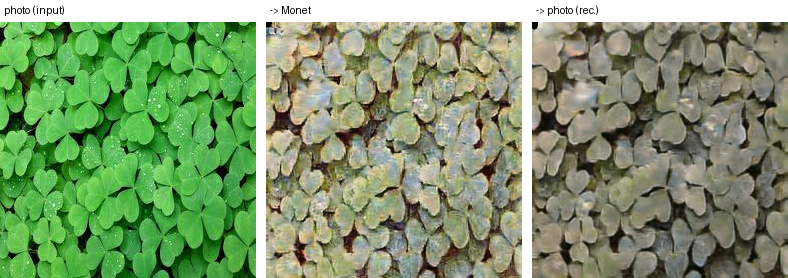

**3. `f01164b232.jpg`** — cycle L1 0.1481, LPIPS change 0.487, LPIPS rec. 0.708, content cos 0.752

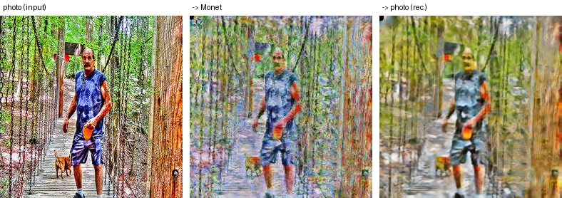

**4. `831831cd60.jpg`** — cycle L1 0.1309, LPIPS change 0.544, LPIPS rec. 0.470, content cos 0.541

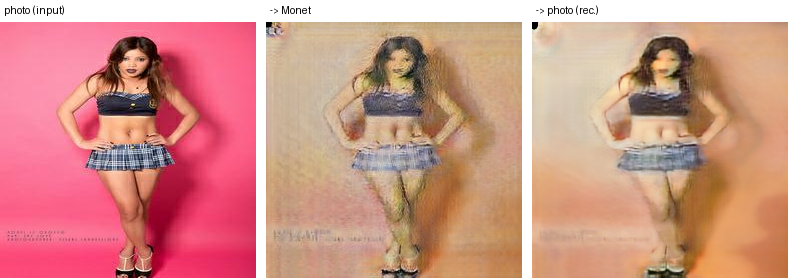

### B2A: lowest input-vs-translation content similarity

**1. `3a7a0992dd.jpg`** — cycle L1 0.0516, LPIPS change 0.521, LPIPS rec. 0.320, content cos 0.357

**2. `70b1293521.jpg`** — cycle L1 0.0917, LPIPS change 0.744, LPIPS rec. 0.367, content cos 0.373

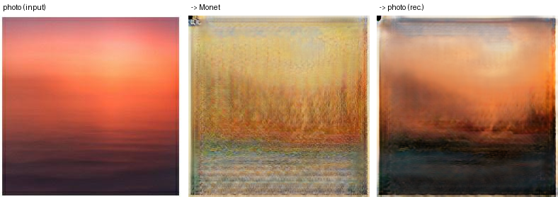

**3. `d2e17623a7.jpg`** — cycle L1 0.0455, LPIPS change 0.524, LPIPS rec. 0.254, content cos 0.388

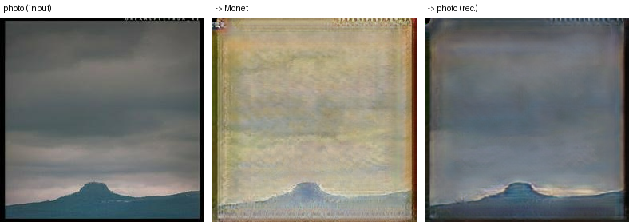

**4. `0845e8dc24.jpg`** — cycle L1 0.0678, LPIPS change 0.582, LPIPS rec. 0.453, content cos 0.388

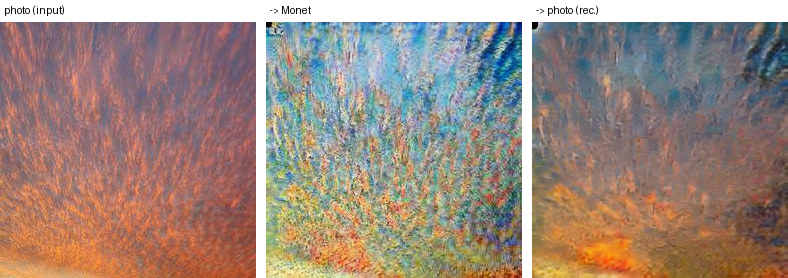

### B2A: smallest perceptual change (possible under-translation)

**1. `bc76a34f9d.jpg`** — cycle L1 0.0536, LPIPS change 0.199, LPIPS rec. 0.253, content cos 0.829

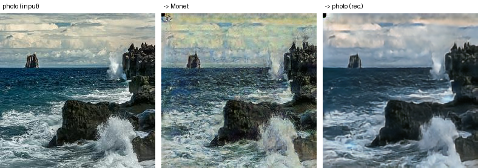

**2. `4b0c0d7145.jpg`** — cycle L1 0.0464, LPIPS change 0.206, LPIPS rec. 0.247, content cos 0.854

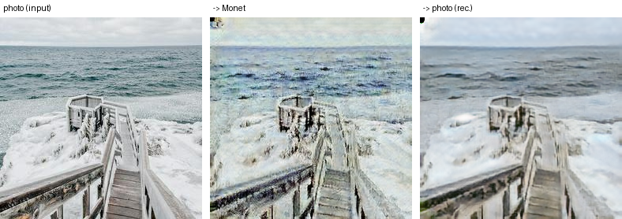

**3. `4134a75abc.jpg`** — cycle L1 0.0714, LPIPS change 0.211, LPIPS rec. 0.283, content cos 0.787

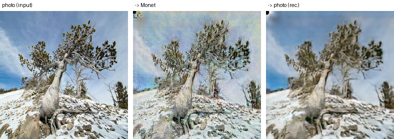

**4. `421cf4d925.jpg`** — cycle L1 0.0641, LPIPS change 0.212, LPIPS rec. 0.175, content cos 0.814

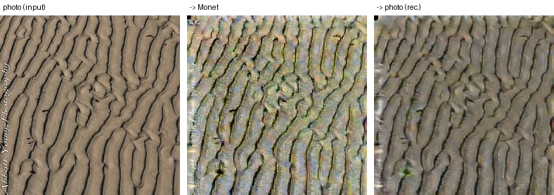

## A2B (Monet -> photo), 300 images

| Score | median | 5th pct | 95th pct |
|---|---|---|---|
| cycle_l1 | 0.0432 | 0.0302 | 0.0633 |
| lpips_change | 0.4013 | 0.2688 | 0.5803 |
| lpips_rec | 0.3294 | 0.2147 | 0.5053 |
| content_cos | 0.7441 | 0.6216 | 0.8482 |

### A2B: largest cycle-reconstruction error

**1. `4f7e01f097.jpg`** — cycle L1 0.0859, LPIPS change 0.575, LPIPS rec. 0.777, content cos 0.747

**2. `6782e7cb2a.jpg`** — cycle L1 0.0807, LPIPS change 0.425, LPIPS rec. 0.492, content cos 0.723

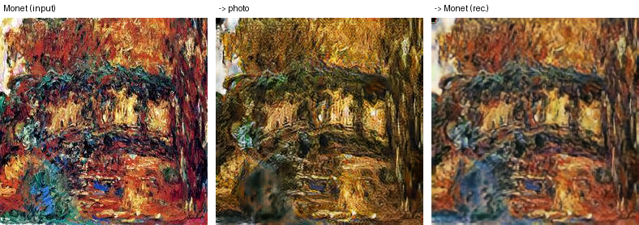

**3. `ad0101d010.jpg`** — cycle L1 0.0784, LPIPS change 0.389, LPIPS rec. 0.495, content cos 0.702

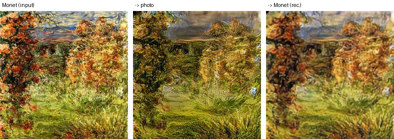

**4. `09b76b6471.jpg`** — cycle L1 0.0767, LPIPS change 0.424, LPIPS rec. 0.516, content cos 0.710

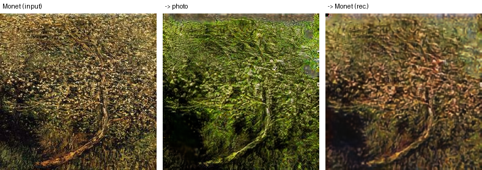

### A2B: lowest input-vs-translation content similarity

**1. `47a0548067.jpg`** — cycle L1 0.0302, LPIPS change 0.572, LPIPS rec. 0.261, content cos 0.530

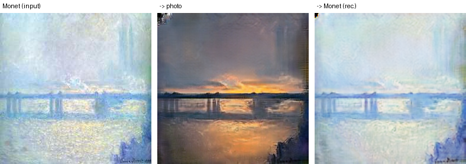

**2. `429e382095.jpg`** — cycle L1 0.0350, LPIPS change 0.436, LPIPS rec. 0.293, content cos 0.566

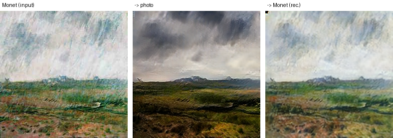

**3. `93132f89ee.jpg`** — cycle L1 0.0598, LPIPS change 0.399, LPIPS rec. 0.411, content cos 0.578

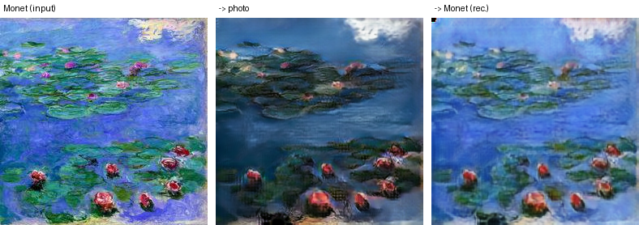

**4. `cf6488d84c.jpg`** — cycle L1 0.0568, LPIPS change 0.450, LPIPS rec. 0.368, content cos 0.578

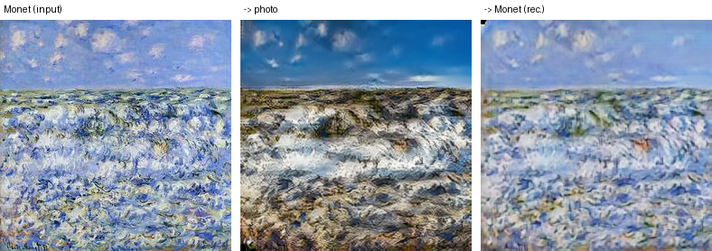

### A2B: smallest perceptual change (possible under-translation)

**1. `8ee2933868.jpg`** — cycle L1 0.0385, LPIPS change 0.190, LPIPS rec. 0.152, content cos 0.802

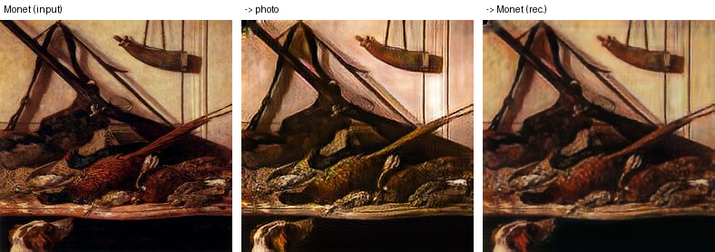

**2. `c78b4fa3a9.jpg`** — cycle L1 0.0460, LPIPS change 0.230, LPIPS rec. 0.197, content cos 0.696

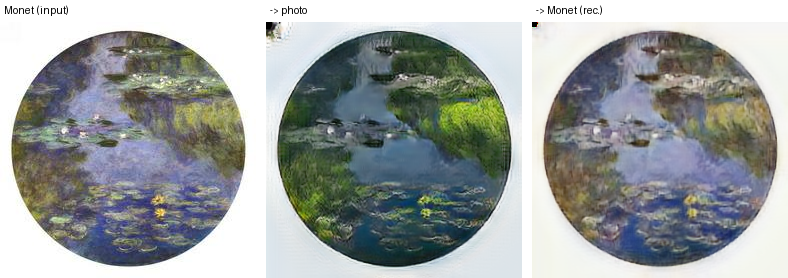

**3. `9843bc25c5.jpg`** — cycle L1 0.0395, LPIPS change 0.239, LPIPS rec. 0.183, content cos 0.843

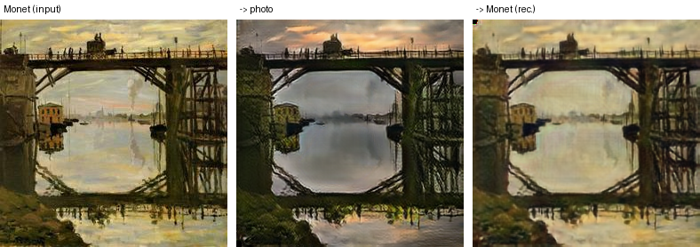

**4. `51db3fc011.jpg`** — cycle L1 0.0484, LPIPS change 0.239, LPIPS rec. 0.308, content cos 0.848

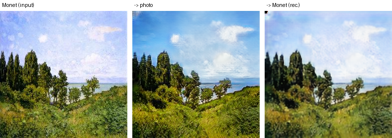
